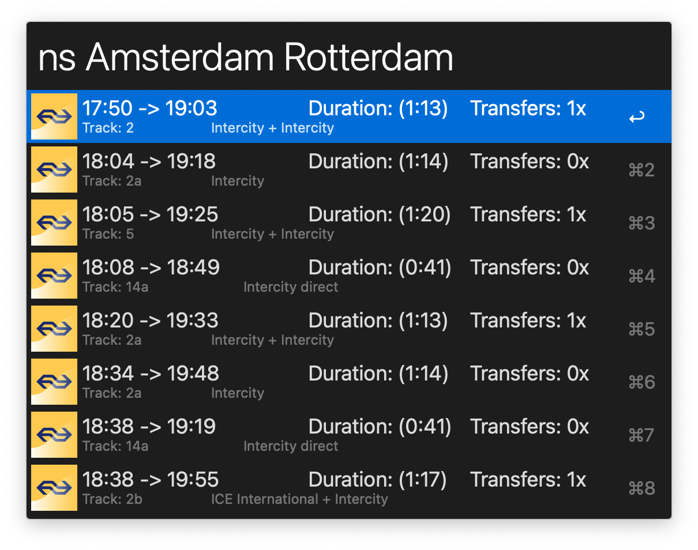

# NS (Nederlandse Spoorwegen) Train schedule for Alfred


Alfred workflow for getting NS Train schedule.



## Getting started

### Prerequisites

Project uses standard Python 2.7 shipped with all modern OSX distributions. No dependencies are required for running the
workflow.

⚠️ Make sure to get API key from https://apiportal.ns.nl/ and set it as workflow environment variable NS_APIKEY during
the installation.

### Installing

Download `NS_Schedule.alfredworkflow` file from the latest release
at [Releases](https://github.com/artemy/alfred-ns-schedule/releases) page and open it with Alfred.
Change the value of NS_APIKEY variable to the value you've received from NS at the _Prerequisites_ step.

### How to Use

Open Alfred and type `ns` and names of two train stations you want to see schedule for. Workflow will display list of
upcoming trains for the route you have specified. Pressing `Enter` on a displayed item will open it on NS website, so
you can get more details.


## Running the tests

Make sure to first install test dependencies:

```shell
pip install -r requirements.txt
```

To run tests, execute

```shell
python -m ns_schedule_test
```

If you want to get coverage figures through `coverage` tool:

```shell
coverage run -m unittest ns_schedule_test # gather test data
coverage report -m # display coverage figures
```

## Built With

* [Python 2.7](https://docs.python.org/2.7/)
* [GNU Make](https://www.gnu.org/software/make/manual/make.html) - Build scripting
* [mock](https://mock.readthedocs.org/) - Testing library
* [coverage.py](https://coverage.readthedocs.io/) - Code coverage measurement

## Contributing

Pull requests are welcome. For major changes, please open an issue first to discuss what you would like to change.

## License

This project is licensed under the MIT License - see the [LICENSE.md](LICENSE.md) file for details

## Acknowledgments

See [Contributors](https://github.com/artemy/ns_schedule_test/contributors) for the list of contributors.
