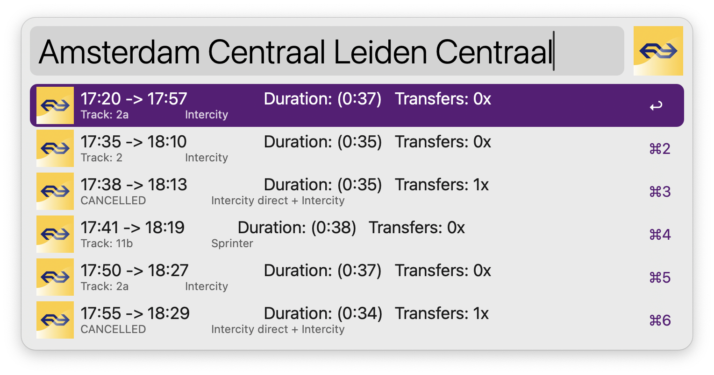

# NS (Nederlandse Spoorwegen) Train schedule for Alfred 5


Alfred workflow for getting NS Train schedule.



## Getting started

⚠️ This workflow requires [Alfred 5](https://www.alfredapp.com/alfred-5-whats-new/).
Alfred 4 users can use [version 2.0](https://github.com/artemy/alfred-ns-schedule/releases/tag/v2.0) of the workflow.

### Prerequisites

Project requires Python 3.8+ to run, which is not included by default with macOS. You can install Python 3 using
this [guide](https://docs.python-guide.org/starting/install3/osx/).

⚠️ Make sure to get API key from https://apiportal.ns.nl/ and set it in a user configuration of the workflow.
Subscribe to the product [NS-App](https://apiportal.ns.nl/product#product=NsApp). 

### Installing

Download `NS_Schedule.alfred5workflow` file from the latest release
at [Releases](https://github.com/artemy/alfred-ns-schedule/releases) page and open it with Alfred.
Change the value of NS_APIKEY variable to the value you've received from NS at the _Prerequisites_ step.

### How to Use

Open Alfred and type `ns` and names of the origin station followed by the destination station you want to see schedule for. Workflow will display list of
upcoming trains for the route you have specified. Pressing `Enter` on a displayed item will open it on NS website, so
you can get more details.


## Running the tests

Make sure to first install test dependencies:

```shell
pip3 install -r requirements.txt
```

To run tests, execute

```shell
python3 -m ns_schedule_test
```

If you want to get coverage figures through `coverage` tool:

```shell
coverage run -m unittest ns_schedule_test # gather test data
coverage report -m # display coverage figures
```

## Built With

* [Python 3.8](https://docs.python.org/3.8/)
* [GNU Make](https://www.gnu.org/software/make/manual/make.html) - Build scripting
* [coverage.py](https://coverage.readthedocs.io/) - Code coverage measurement

## Contributing

Pull requests are welcome. For major changes, please open an issue first to discuss what you would like to change.

## License

This project is licensed under the MIT License - see the [LICENSE.md](LICENSE.md) file for details

## Acknowledgments

See [Contributors](https://github.com/artemy/ns_schedule_test/contributors) for the list of contributors.
